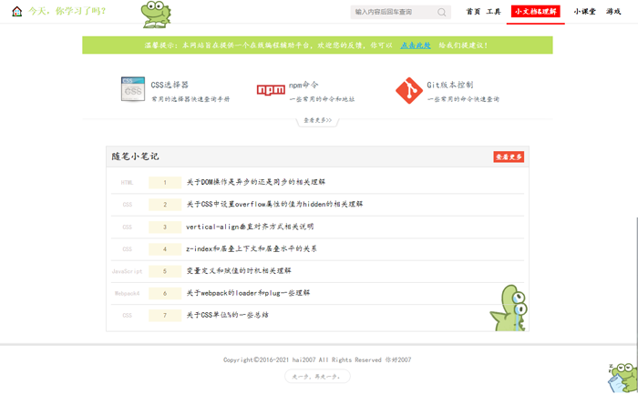

<p align='center'>
    <a href='https://hai2007.gitee.io/sweethome/' target='_blank'>
        
    </a>
</p>

# [🏠 今天，你写代码了吗？](https://hai2007.gitee.io/sweethome/)

<p align='center'>
    <a href='https://hai2007.gitee.io/sweethome/' target='_blank'>
        
    </a>
</p>

<p align="center">
    <a href="https://github.com/hai2007/SweetHome/graphs/code-frequency" target='_blank'>
        
    </a>
    <a href="https://github.com/hai2007/SweetHome/graphs/commit-activity" target='_blank'>
        
    </a>
    <a href="https://github.com/hai2007/SweetHome" target='_blank'>
        
    </a>
</p >

## 如何启动本地编辑？

首先，你需要确保本地安装了node.js，然后，执行下面命令安装项目依赖：

```bash
npm install
```

接着，启动下面命令会自动打开页面，修改内容页面也自动刷新：

```bash
npm run dev
```

如果你想发布开发的代码，执行下面命令进行打包：

```bash
npm run build
```

## 在线代码演示

为了更好的演示代码，我们提供了一个前端代码在线可编辑运行工具，访问地址：

```
https://hai2007.gitee.io/sweethome/#/editor
```

如果你希望打开的时候使用你设定的初始化代码，有下列三种方式：

- 第一种：通过共享storage的方式

非跨域的页面如果想控制打开页面编辑器内容，只需要在打开前主动修改```localStorage```的```hai2007-sweethome-editor-html-code```条目内容即可。

- 第二种：通过URL参数提供代码地址

任意页面打开此页面的时候，如果想选择提前定义好的某个内容作为编辑器内容，可以通过参数告知，语法：```?file=xxx```。当然，页面需要提前在```examples/lazy-load.js```中懒加载注册好。

- 第三种：通过URL参数提供代码内容

任意页面打开此页面的时候，如果想直接传递某个内容作为编辑器内容，可以通过参数告知，语法：```?content=xxx```。此方法的缺点是，内容不可以过多，其次，如果没有特别说明，传递的内容需要经过```encodeURIComponent```处理，如果没有经过处理，语法：```?content=xxx&decode=no```。

开源协议
---------------------------------------
[Apache-2.0](https://github.com/hai2007/SweetHome/blob/master/LICENSE)

Copyright (c) 2016-2021 [hai2007](https://hai2007.gitee.io/sweethome/) 走一步，再走一步。
